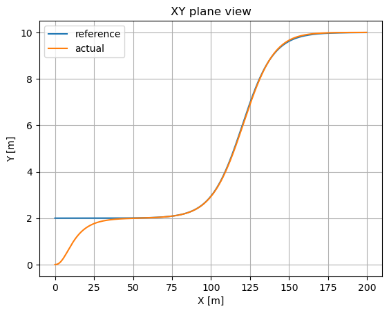

Car lateral MPC

This project is meant to be an implementation of a simulation of an MPC controller on a car following a trajectory in the XY plane.

-PHYSICAL MODEL-
The model used is a single rigid body bycicle model.
The system can be described in terms of 3 dof, the absolute position X, the absolute position Y and the yat angle PSI.
For simplification, the equations of motions are written with respect to the local referece xy that is attache to the center of mass of the moving vehicle.
The control action on the system is the angle delta, which is the steering angle of the car, through the variation of which we can control the modulus of the velocity vector along the y local axis.
The longitudinal velocity of the car is assumed to be constant xd, and due to this semplification no forces will be considered along the x direction.
Due to the previous assumption, the component of position X and Y are linked together from the velocity in the local y direction and the yaw angle PSI, therefore we will exclude the variable X in our state vector considering the following:
Yd = xd * sin(PSI) + yd * cos(PSI)
Xd = xd * cos(PSI) - yd * sin (PSI)
From which it is evident that PSI and yd are the only two variables

The model used is a LTI system fed into a basic MPC controller
Finally the discrete LTI model is augmented to take as input the Ddelta (variation of the steering angle) as it is assumed the minimization will not be done on the steering angle alone (this would produce low steering and potentially vibrating around 0), but instead on the variation of the steering.

-MATHEMATICAL DETAILS-
All integration of differential equations is done through the forward Euler method.
The transformation of the system equations in state space system is meant to rewrite the problem in term of ODE equations only.

-SIMULATION-
To solve linear algebra the library Eigen is used (https://eigen.tuxfamily.org/index.php?title=Main_Page).
The time of the simulation is set to a number of secods, based on which the trajectory vector will be generated and with it the main loop will proceed.
The simulation will proceed along the following logic

- Initialize all quantities, matrixes and trajectory vector

- Main simulation loop (one loop per each MPC update step, the update step is a variable to be defined)
    - Read current system state (use the non linear system data -> fusion with LTI data can be considered)
    - Calculate the optimized Ddelta vectors for the next N time steps
    - Calculate steering angle (real system input) with the first element of the Ddelta vector
    - System status update loop (one loop per each fraction of update step, update step to be divided in M fractions, value to be defined)
        - use the input Ddelta and current status to evaluate the system with the non-linear state space equations
    - Write the states of the system in a convenient location for data plotting

-DATA VISUALIZATION-
A simple python script using matplotlib will be used to plot the various states with respect to time and analyze the results

